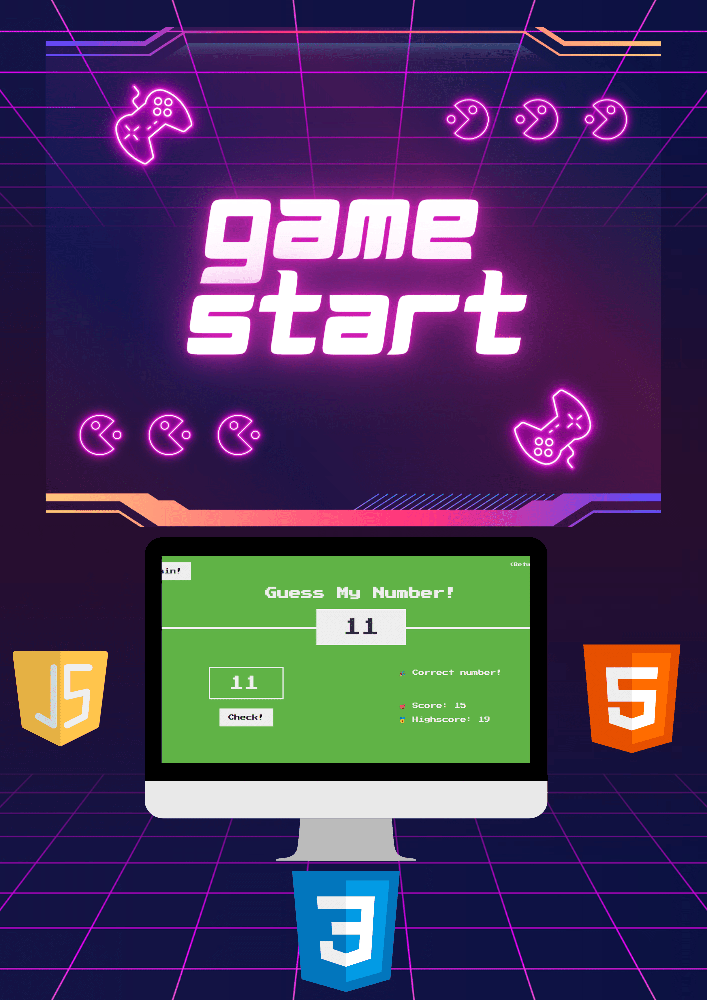

<!DOCTYPE html>
<html>
<head>
  <link rel="stylesheet" href="styles.css">
</head>
<body>
  <h1>Guess My Number!</h1>
  

    This project is a simple number guessing game implemented using HTML and JavaScript.
  

  

        

  

  <h2>How to Play</h2>
  <ol>
    <li>Open the <code>index.html</code> file in your web browser.</li>
    <li>The game will generate a random number between 1 and 20.</li>
    <li>Enter your guess in the input field provided.</li>
    <li>Click the "Check!" button to check if your guess is correct.</li>
    <li>The game will provide feedback on whether your guess is too high or too low.</li>
    <li>Keep guessing until you correctly guess the number.</li>
  </ol>

  <h2>Features</h2>
  <ul>
    <li>Random number generation between 1 and 20.</li>
    <li>Feedback on whether the guess is too high or too low.</li>
    <li>Score tracking to keep track of the number of guesses.</li>
    <li>Highscore tracking to keep track of the best score.</li>
  </ul>

  <h2>Preview</h2>
  

  <h2>Getting Started</h2>
  <ol>
    <li>Clone the repository: <code>git clone https://github.com/your-username/guess-my-number.git</code></li>
    <li>Open the project folder.</li>
    <li>Open <code>index.html</code> in your preferred web browser.</li>
  </ol>

  <h2>License</h2>
  
This project is licensed under the MIT License. See the <a href="LICENSE">LICENSE</a> file for details.

</body>
</html>
